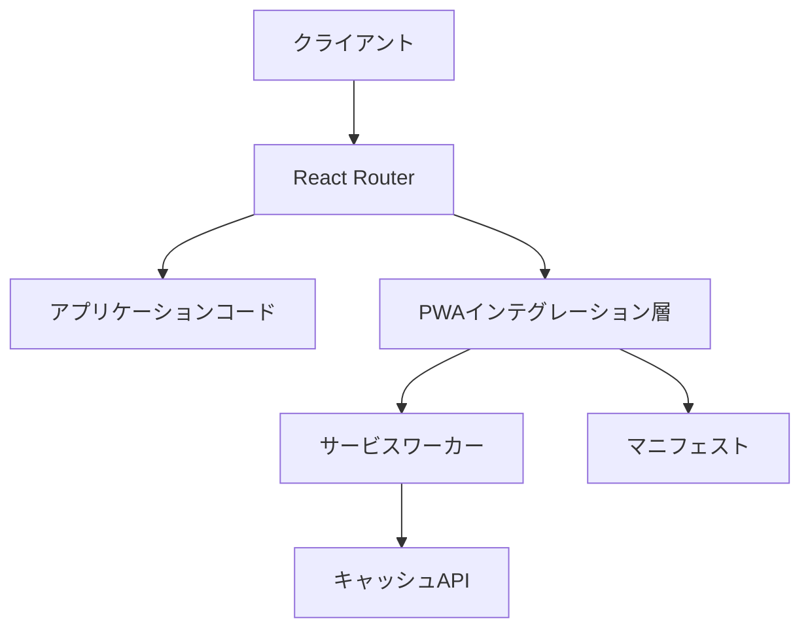

# 設計文書

## 概要

このプロジェクトでは、React RouterベースのアプリケーションをPWA（Progressive Web App）として実装します。React Routerの特性を考慮し、従来のindex.htmlが存在しない構造に適応した設計を行います。

## アーキテクチャ

### 全体構造

PWA実装には以下の主要コンポーネントが必要です：

1. **サービスワーカー**: キャッシュ管理を担当
2. **マニフェストファイル**: アプリのメタデータとインストール設定を定義
3. **PWAインテグレーション層**: React Routerとの連携を担当



### React Router統合

React Routerを使用したアプリケーションでは、従来のindex.htmlが存在しない代わりに、`app/root.tsx`がHTMLの基本構造を定義しています。PWA実装では以下の点に注意する必要があります：

1. **サービスワーカー登録**: クライアントサイドのエントリーポイントでサービスワーカーを登録
2. **マニフェスト参照**: `root.tsx`の`<head>`セクションにマニフェストへのリンクを追加
3. **メタタグ**: 必要なPWAメタタグを`<head>`セクションに追加

## コンポーネントとインターフェース

### サービスワーカー

サービスワーカーは以下の機能を実装します：

1. **静的アセットのキャッシュ**: CSS、JS、画像などの静的ファイルをキャッシュ
2. **アプリケーションシェルのキャッシュ**: 基本的なUIコンポーネントをキャッシュ

```typescript
// service-worker.ts (概念的な実装)
self.addEventListener('install', (event) => {
  // 静的アセットのプリキャッシュ
});

self.addEventListener('activate', (event) => {
  // 古いキャッシュの削除
});
```

### PWAマニフェスト

マニフェストファイルは以下の情報を含みます：

```json
{
  "name": "MornD",
  "short_name": "MornD",
  "start_url": "/",
  "display": "standalone",
  "background_color": "#ffffff",
  "theme_color": "#4f46e5",
  "icons": [
    {
      "src": "/icons/icon-192x192.png",
      "sizes": "192x192",
      "type": "image/png"
    },
    {
      "src": "/icons/icon-512x512.png",
      "sizes": "512x512",
      "type": "image/png"
    },
    {
      "src": "/icons/maskable-icon.png",
      "sizes": "512x512",
      "type": "image/png",
      "purpose": "maskable"
    }
  ]
}
```

### PWAインテグレーションフック

React Routerアプリケーションでのサービスワーカー登録とPWA機能を管理するカスタムフック：

```typescript
// usePWA.ts
export function usePWA() {
  // サービスワーカー登録とイベント処理
  useEffect(() => {
    // サービスワーカー登録ロジック
  }, []);
  
  return {};
}
```


## エラー処理


### サービスワーカーエラー処理

```typescript
// サービスワーカー登録エラー処理
if ('serviceWorker' in navigator) {
  navigator.serviceWorker.register('/service-worker.js')
    .then(registration => {
      console.log('ServiceWorker registered with scope:', registration.scope);
    })
    .catch(error => {
      console.error('ServiceWorker registration failed:', error);
      // フォールバック処理
    });
}
```

## テスト戦略

### ユニットテスト

- サービスワーカーのキャッシュ戦略テスト

### テスト注記

統合テストとエンドツーエンドテストは人手で実行するため、自動化は行いません。以下の項目は手動で検証します：

- インストールフロー
- Lighthouseを使用したPWA評価
- 異なるデバイスとブラウザでの動作確認

## React Router固有の考慮事項

### ルーティングとキャッシュ戦略

React Routerのルーティングシステムとサービスワーカーのキャッシュ戦略を連携させます：

1. **ルートベースのキャッシュ**: 頻繁にアクセスされるルートを優先的にキャッシュ
2. **動的ルート**: パラメータを含むルートのキャッシュ戦略
3. **ナビゲーション先読み**: ユーザーが訪問する可能性の高いルートを先読みしてキャッシュ